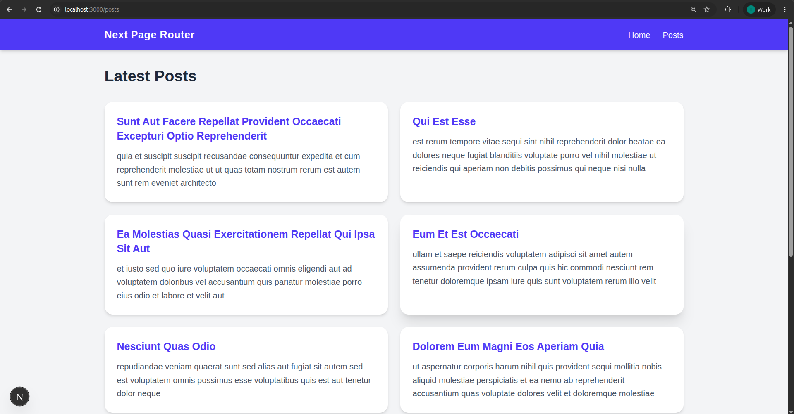

## Next.js Routing Implementation Assignment

This project demonstrates two separate Next.js implementations:

1️⃣ App Router Implementation → `next-app-router`  
2️⃣ Pages Router Implementation → `next-page-router`

Both projects use:

- TypeScript (TSX)
- Tailwind CSS
- JSONPlaceholder API
- Header & Footer layout system
- File-based routing

---

## Assignment Questions

### 🔹 App Router Implementation

1. Create 1st repo implemented with the App router implementation **“next-app-router”**.
2. Create a Header and Footer components wrapping Homepage in **“layout.js”**.
3. Create a Page **“Posts”** calling API  
   `https://jsonplaceholder.typicode.com/posts`
4. Display 10 posts having:
   - title
   - body
5. The page should be accessible on `/posts` route.

---

### 🔹 Pages Router Implementation

1. Create 2nd repo implemented with Page router implementation **“next-page-router”**.
2. Create Header and Footer components wrapping homepage in **“_app.js”**.
3. Create a Page **“Posts”** calling API  
   `https://jsonplaceholder.typicode.com/posts`
4. Display 10 posts having:
   - title
   - body
5. The page should be accessible on `/posts` route.

---

## App Router Project – `next-app-router`

### Approach

This project uses the modern **App Router (`app/` directory)** introduced in Next.js 13+.

### Key Implementation Details

- `layout.tsx` wraps all pages globally
- Header & Footer included in layout
- Posts page created inside `app/posts/page.tsx`
- Data fetched using async Server Component
- Only first 10 posts displayed
- Styled using Tailwind CSS

---

##  Pages Router Project – `next-page-router`

### Approach

This project uses the traditional **Pages Router (`pages/` directory)**.

### Key Implementation Details

- `_app.tsx` wraps entire application
- Header & Footer included inside `_app.tsx`
- Posts page created inside `pages/posts.tsx`
- Data fetched using `getServerSideProps`
- Only first 10 posts displayed
- Styled using Tailwind CSS

---
### Screenshot
