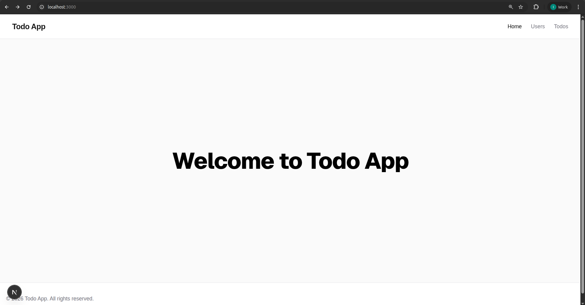
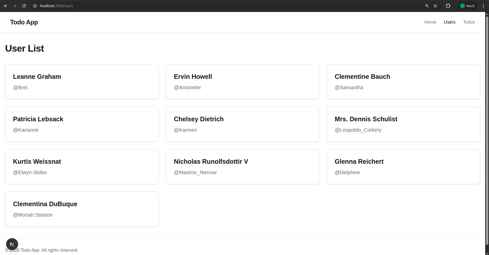
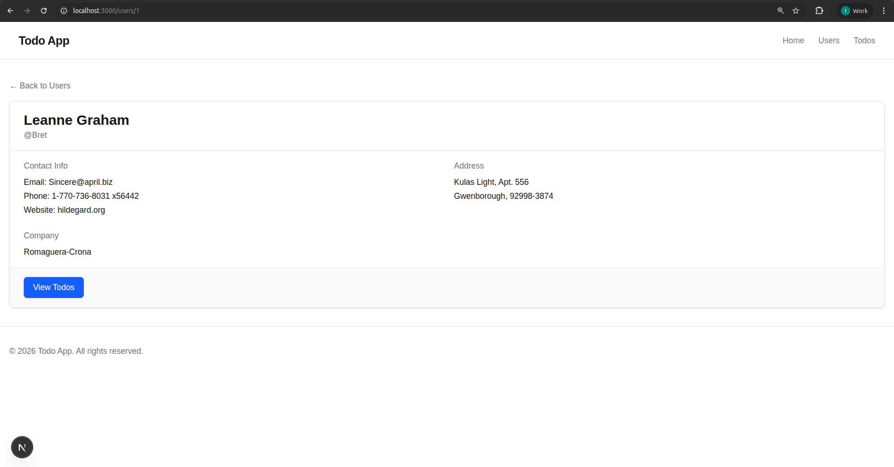
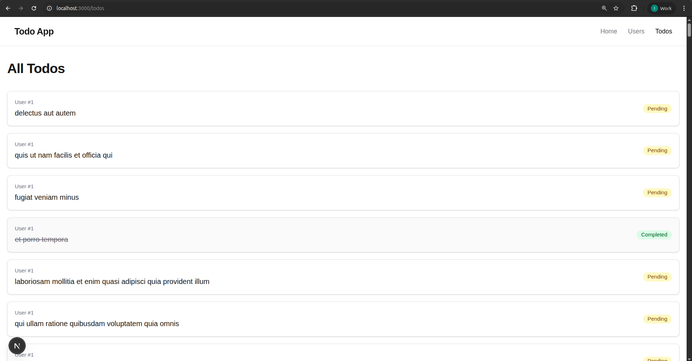

# Next.js page and routing assignment

## Features

- **User Management**:
  - View a list of all users.
  - Click on a user to view their detailed profile (contact info, address, company).
  - Navigate from user details to their specific todos.
- **Todo Management**:
  - View a global list of todos.
  - Filter todos by user (via user profile).
  - Visual indicators for completed vs. pending tasks.
  - Links back to the todo owner.

## API Reference

The application uses the following endpoints from JSONPlaceholder:

- `https://jsonplaceholder.typicode.com/users` - Get all users
- `https://jsonplaceholder.typicode.com/users/[id]` - Get single user
- `https://jsonplaceholder.typicode.com/todos` - Get all todos
- `https://jsonplaceholder.typicode.com/users/[id]/todos` - Get todos for a user

## Screenshots

